# Updraft CCRO Dashboard — Presentation Pack
> Prepared: 2026-02-27 | Presenter: Rob Healey

---

## 1. What We've Built

A purpose-built CCRO (Chief Compliance & Risk Officer) management platform for Updraft —
replacing a patchwork of Word documents, Excel registers, and email threads with a single,
auditable, interconnected system of record.

---

## 2. Module Architecture

```mermaid
graph TD
    DASH[🏠 Dashboard\nLive overview & KPIs]

    subgraph RISK ["⚠️ Risk & Controls"]
        RR[Risk Register\nInherent · Residual · Appetite]
        CL[Controls Library\nPreventative · Detective · Directive]
        CT[Control Testing\nSchedule · Results · Pass Rate]
        RA[Risk Acceptances\nProposal · CCRO Review · Approval]
    end

    subgraph COMP ["📋 Compliance"]
        RU[Regulatory Universe\nFCA · PRA · ICO · Legislation]
        PL[Policies\nOwnership · Review · Linking]
        SM[SMCR Register\nSenior Managers · Certified · Conduct]
        CD[Consumer Duty\nOutcomes · Measures · MI Metrics]
    end

    subgraph OPS ["🔭 Operational"]
        HS[Horizon Scanning\nRegulatory · Legislative · Market]
        PR[Processes & IBS\nProcess Library · Scenarios · Resilience]
        RC[Regulatory Calendar\nDeadlines · Alerts · Events]
    end

    subgraph OVERSIGHT ["📊 Oversight & Reporting"]
        AC[Actions Register\nTracking · Accountability · Timeline]
        CR[Change Requests\nPropose · Review · Approve]
        RP[Reports\nBoard · Audit Committee · ExCo]
        EX[Export Centre\nHTML Packs · 14 sections · Deep-dives]
        AL[Audit Log\nImmutable · Who · What · When]
    end

    subgraph PLATFORM ["⚙️ Platform"]
        US[Users & Roles\nCCRO · CEO · Owner · Viewer]
        NT[Notifications\nDeadlines · Changes · Reminders]
        GS[Global Search\nAll entities · Instant]
    end

    DASH --> RR
    DASH --> CL
    DASH --> HS
    DASH --> CD
    DASH --> AC
    DASH --> RA

    RR --> AC
    RR --> CL
    RR --> RA
    CL --> CT
    HS --> RR
    HS --> AC
    RU --> CL
    RU --> PL
    PR --> RR
    PR --> CL
    AC --> CR
    AL -.->|logs all changes| RR & CL & AC & SM & RU & PL & HS & PR
    EX -.->|exports all| RISK & COMP & OPS & OVERSIGHT
    NT -.->|alerts from| CR & RC & CT & PR
```

---

## 3. Entity Relationships — How Data Connects

---

## 4. Role-Based Access Model

---

## 5. Technology Stack

---

## 6. Deployment Architecture

---

## 7. What Has Been Built — Sprint Summary

| Sprint | Delivered |
|--------|-----------|
| Foundation | Risk Register, Controls, Actions, Compliance (Regulations, Policies, SMCR, Consumer Duty), basic dashboard |
| Navigation & Panels | Slide-out detail panels for all entities, URL deep-links, back button, global search |
| Audit & Permissions | Full audit log, role-based permissions, save reliability across all 70 store functions |
| Horizon Scanning | New module — 28 regulatory/market horizon items, in-focus spotlight, risk/action linking |
| Relational Refactor | Risk → Control + Action junction tables; fixed data destruction bug on risk saves |
| Interactivity Audit | 27 static elements wired up — every number is now a clickable filter or link |
| Processes & IBS | Consolidated OR into Processes page; IBS registry; scenario management; self-assessment |
| UX Polish | Default "My items" views, collapsible sections, Consumer Duty CCRO manage tab, bento card filters |
| Export Centre | 14-section HTML export packs, table of contents, deep-dives, risk acceptances, SMCR, horizon |
| Controls & CD Deep Polish | Trend graphs, accountability timeline, Consumer Duty metrics layout, modal animations |

**Current state:** ~40 pages/routes · 20+ API endpoints · Full PostgreSQL schema · 4 user roles · Zero unresolved bugs

---

## 8. Roadmap — What's Next

```mermaid
gantt
    title Updraft CCRO Dashboard — Development Roadmap
    dateFormat YYYY-MM
    axisFormat %b %Y

    section Phase 2 — Data & Intelligence
    Realistic demo data population      :2026-03, 1M
    Requirements document finalised     :2026-03, 2w
    Board pack template builder         :2026-03, 6w
    Automated weekly email digest       :2026-04, 4w
    FCA/PRA RSS regulatory alert feed   :2026-04, 6w

    section Phase 3 — Integration
    SSO / Active Directory integration  :2026-05, 8w
    Migration to corporate infra        :2026-06, 6w
    External API endpoints (read-only)  :2026-07, 8w
    Multi-entity / group structure      :2026-08, 10w

    section Phase 4 — Intelligence Layer
    AI regulatory mapping assistant     :2026-09, 12w
    Automated horizon scan (RSS/API)    :2026-10, 8w
    Advanced analytics & benchmarking  :2026-11, 10w
    Native mobile app                   :2027-01, 16w
```

---

## 9. Key Numbers (current state)

| Metric | Value |
|--------|-------|
| Modules deployed | 14 |
| API routes | 20+ |
| Database tables | 45+ |
| User roles | 4 (CCRO, CEO, Owner, Viewer) |
| Audit log events | Every create/update/delete logged |
| Export sections | 14 (including deep-dives) |
| Sprints completed | 10 |
| Open bugs | 0 |
| TypeScript errors | 0 |
| Agent reviews run | 20+ UAT · 6 Designer · 4 Compliance |

---

## 10. How to Copy This Into a Presentation Tool

**Mermaid renders natively in:**
- GitHub (paste into any .md file)
- Notion (use `/code` block, language = `mermaid`)
- GitLab, Obsidian, Typora

**To convert to PowerPoint/Keynote/Miro:**
1. Open [mermaid.live](https://mermaid.live)
2. Paste any diagram block above
3. Export as PNG or SVG
4. Drop into your slide tool

**Suggested slide structure:**
1. Title: "Updraft CCRO Platform — CEO Briefing"
2. What we built (module architecture diagram — Diagram 2)
3. How data connects (entity relationships — Diagram 3)
4. Who uses it and how (role-based access — Diagram 4)
5. How it's built (technology stack — Diagram 5)
6. What's next (roadmap gantt — Diagram 8)
7. Key numbers (table from section 9)
