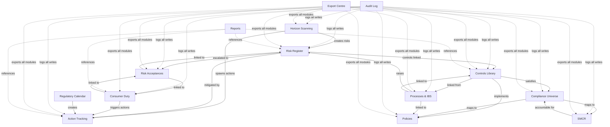
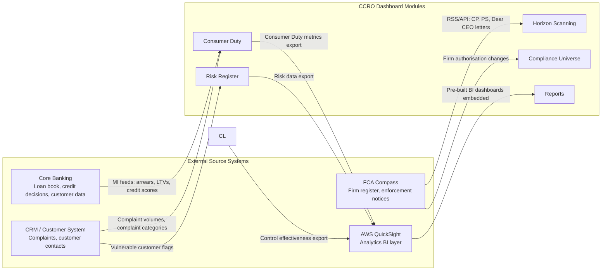

# Updraft CCRO Dashboard — Module Reference
> Prepared: 2026-02-27 | Version 1.0

Each module entry covers: what it does · data it writes/creates · bulk extract/upload · how it
feeds other modules · why it exists and the FCA regulatory basis.

---

## Module Map — How Data Flows Between Modules

---

## 1. Risk Register

### What It Does
The firm's enterprise risk register. Maintains every identified risk with inherent and residual
likelihood × impact scores, control effectiveness, direction of travel, and risk appetite.
The 5×5 heat map on the home dashboard visualises the full portfolio in real time.

### Data Written / Created
| Entity | Key fields |
|---|---|
| `Risk` | reference (RR-001), name, category L1/L2, owner, inherent L×I, residual L×I, appetite, direction, inFocus, lastReviewed |
| `RiskSnapshot` | Monthly capture of residual scores — powers the portfolio trend chart |
| `RiskControl` | Inline free-text controls per risk (separate from Controls Library links) |
| `RiskMitigation` | Action-linked mitigation items per risk |
| `RiskControlLink` | Junction: Risk ↔ Controls Library entry |
| `RiskActionLink` | Junction: Risk ↔ Action |

### Bulk Operations
| Direction | Method | What it covers |
|---|---|---|
| **Import** | CSV upload (via Risk Register → Import) | Create/update risks including scores and controls |
| **Export** | Export Centre → Risk Register section | Full CSV of all risks; HTML pack with optional per-risk deep-dive spotlights |

### Feeds Other Modules
- **Actions** — risks link to actions as mitigations (`RiskActionLink`)
- **Controls Library** — risks link to formal controls (`RiskControlLink`)
- **Risk Acceptances** — risks above appetite escalate to formal acceptance workflow
- **Home Dashboard** — 5×5 matrix + portfolio trend chart + stat tiles
- **Export Centre** — included in board-pack exports
- **Audit Log** — every create/update/delete logged immutably

### Why It Exists / FCA Basis
> **SYSC 7 (Risk control)** requires firms to have adequate risk management systems.
> **SYSC 4.1.1R** requires robust governance arrangements with a clear organisational structure.
> **FCA Principle 3** requires firms to take reasonable care to organise and control their affairs responsibly with adequate risk management systems.
> The Risk Register is the firm's primary evidence of compliance with these requirements.

---

## 2. Action Tracking

### What It Does
Centralised log of all remediation and improvement actions across the firm. Actions arise from
risk reviews, control testing failures, Consumer Duty MI, horizon scanning, regulatory changes,
and ad-hoc decisions. Each action has a priority (P1/P2/P3), owner, due date, and status
workflow. Change proposals allow owners to request date extensions or reassignments, with
CCRO approval.

### Data Written / Created
| Entity | Key fields |
|---|---|
| `Action` | reference (ACT-001), title, description, status, priority, assignee, dueDate, source, linked risk/control/CD metric |
| `ActionChange` | Date extension or reassignment proposals — CCRO approve/reject |
| `ChangeRequest` | Formal change proposals linked to actions |

### Bulk Operations
| Direction | Method | What it covers |
|---|---|---|
| **Import** | CSV upload (Actions → Import) | Bulk create actions with priority, owner, due date |
| **Export** | Export Centre → Actions section | Full CSV; HTML pack with optional action spotlights |

### Feeds Other Modules
- **Horizon Scanning** — horizon items spawn tracked actions (`HorizonActionLink`)
- **Consumer Duty** — CD MI triggers linked remediation actions
- **Risk Register** — risks link to actions as mitigations
- **Regulatory Calendar** — regulatory deadlines generate tracked actions
- **Reports** — action pipeline chart and open action counts surface in board packs
- **Home Dashboard** — action tracking section with priority swimlane and stat tiles

### Why It Exists / FCA Basis
> **SYSC 4.1.1R** — Firms must have robust governance arrangements including clear lines of
> responsibility and effective processes for managing risk.
> **FCA Consumer Duty (PRIN 12)** — Firms must identify, monitor, and remediate poor customer
> outcomes. The action register is the evidence trail for remediation.
> **SMCR** — Individual accountability under SMCR requires Senior Managers to demonstrate
> "reasonable steps"; a documented action trail supports that evidence.

---

## 3. Controls Library

### What It Does
Firm-wide library of formal controls across 10 business areas. Each control has a testing
schedule, 12-month test result history, quarterly narrative summaries, monthly owner
attestations, and links to regulations, policies, and processes. A trend graph shows pass-rate
over time. The watched/starred feature lets CCRO highlight priority controls on the dashboard.

### Data Written / Created
| Entity | Key fields |
|---|---|
| `Control` | controlRef (FP-C001), name, business area, type, owner, frequency, isWatched, isActive |
| `TestingSchedule` | Testing frequency, assigned tester, test method summary |
| `TestResult` | Period (year/month), result (Pass/Fail/Partial/Not Tested), tester, evidence, notes |
| `QuarterlySummary` | Narrative write-up per quarter per control schedule, status |
| `Attestation` | Monthly owner attestation — attested yes/no, issues flagged |
| `ControlRegulatoryLink` | Junction: Control ↔ Regulation |
| `PolicyControlLink` | Junction: Control ↔ Policy |

### Bulk Operations
| Direction | Method | What it covers |
|---|---|---|
| **Import** | CSV upload (Controls → Import) | Create/update controls and testing schedules |
| **Export** | Export Centre → Control Test Results section | Full test history by period; quarterly summaries |

### Feeds Other Modules
- **Compliance Universe** — controls are mapped to regulations they satisfy
- **Policies** — controls link to the policies they implement
- **Risk Register** — controls link to the risks they mitigate (`RiskControlLink`)
- **Processes & IBS** — process library entries link to the controls they use
- **Home Dashboard** — watched controls, pass-rate stats, control health section
- **Reports** — control effectiveness summary for board packs

### Why It Exists / FCA Basis
> **SYSC 6 (Compliance)** — Firms must establish, implement, and maintain adequate policies
> and procedures sufficient to ensure compliance and to counter risk.
> **FCA Consumer Duty (PRIN 2A)** — Firms must have appropriate governance and oversight to
> deliver good consumer outcomes. Controls Library is the evidence framework.
> **Three Lines of Defence** — First line controls documented here support second-line (CCRO)
> oversight and third-line (internal audit) review.

---

## 4. Consumer Duty

### What It Does
Tracks compliance with FCA Consumer Duty (PRIN 12 / PRIN 2A) across 4–5 outcomes. Each outcome
contains measures with monthly MI metrics. RAG statuses (Good/Warning/Red) are tracked over time
with 12-month sparklines. The CCRO manage tab allows direct editing of outcomes, measures, and
metrics. Owners update their assigned measures monthly.

### Data Written / Created
| Entity | Key fields |
|---|---|
| `ConsumerDutyOutcome` | name, description, ragStatus, riskOwner, mitigatingActions, summary |
| `ConsumerDutyMeasure` | name, owner, summary, ragStatus, position |
| `ConsumerDutyMI` | metric name, value, previousValue, RAG, appetite, narrative |
| `MetricSnapshot` | Monthly value + RAG per metric — drives 12-month trend sparklines |

### Bulk Operations
| Direction | Method | What it covers |
|---|---|---|
| **Import** | CSV wizard (Consumer Duty → Admin → Import) | Bulk create/update measures and MI metrics |
| **Export** | Export Centre → Consumer Duty section | Full outcome/measure/metric CSV; HTML with RAG status |

### Feeds Other Modules
- **Actions** — Consumer Duty MI failures trigger remediation actions (`consumerDutyMIId` on Action)
- **Risk Acceptances** — CD outcomes can be linked to formal risk acceptances
- **Home Dashboard** — rolling ticker widget cycling outcome/measure/RAG counts
- **Reports** — Consumer Duty section is a standard component in board report templates

### Why It Exists / FCA Basis
> **FCA PRIN 12 (Consumer Duty)** — Firms must act to deliver good outcomes for retail customers
> across four outcome areas: Products & Services, Price & Value, Consumer Understanding,
> Consumer Support.
> **FCA PS22/9** — Implementation rules require firms to maintain ongoing monitoring of
> consumer outcomes with documented MI, evidenced RAG assessments, and board-level attestation.
> **Annual board attestation (PROC-020)** — The board must sign off annually that Consumer Duty
> obligations are being met; this module provides the evidence pack.

---

## 5. Compliance Universe

### What It Does
328-regulation hierarchy of all FCA, PRA, ICO, AML, and legislation obligations applicable to
Updraft. Organised as a 4-level hierarchy (e.g. PRIN → PRIN 2A → PRIN 2A.1). Each regulation
carries a compliance status (Compliant/Partially Compliant/Non-Compliant/Gap/Not Assessed),
assessment notes, applicability rating, and links to the Senior Manager responsible.

### Data Written / Created
| Entity | Key fields |
|---|---|
| `Regulation` | FCA/PRA reference, name, regulatory body, type, hierarchy level, applicability, complianceStatus, assessmentNotes, primarySMF |

### Bulk Operations
| Direction | Method | What it covers |
|---|---|---|
| **Export** | Export Centre → Compliance Universe section | Full CSV by regulatory body / applicability filter |

### Feeds Other Modules
- **Controls Library** — regulations link to the controls that satisfy them
- **Policies** — regulations map to the policies that implement them
- **SMCR** — each regulation has a primary SMF accountable holder
- **Regulatory Calendar** — upcoming regulatory changes tracked as horizon items

### Why It Exists / FCA Basis
> **FCA SYSC 6.1.1R** — Firms must have adequate policies and procedures to ensure compliance
> with applicable requirements.
> The Compliance Universe is the firm's master record of its regulatory perimeter — the
> foundation document for demonstrating to the FCA that obligations are identified, owned,
> and monitored.

---

## 6. Policy Register

### What It Does
Library of 21 internal policies with version history, owner accountability, review schedule,
and links to the regulations they implement and the controls they require. Policies pass through
a status workflow (Draft → Active → Under Review → Archived).

### Data Written / Created
| Entity | Key fields |
|---|---|
| `Policy` | reference (POL-001), name, owner, status, version, effectiveDate, nextReviewDate |
| `PolicyRegulatoryLink` | Junction: Policy ↔ Regulation |
| `PolicyControlLink` | Junction: Policy ↔ Control |
| `PolicyObligation` | Sub-requirements within a policy tracked for implementation |

### Bulk Operations
| Direction | Method | What it covers |
|---|---|---|
| **Export** | Export Centre → Policies section | Full CSV with status filter; HTML with obligation breakdown |

### Feeds Other Modules
- **Controls Library** — controls reference the policies they implement
- **Compliance Universe** — regulations reference the policies that satisfy them
- **Processes & IBS** — process steps reference the policies that govern them
- **Reports** — policy health summary (overdue reviews, draft policies) appears in governance reports

### Why It Exists / FCA Basis
> **SYSC 6.1.1R** — Firms must maintain a documented policy framework aligned to applicable rules.
> **FCA Principle 3** — Adequate management and control requires documented policies with clear
> ownership and regular review cycles.
> **Consumer Duty (PS22/9)** — A Fair Value Assessment policy and a Complaints Handling policy
> are explicit requirements.

---

## 7. SM&CR

### What It Does
Manages all Senior Manager and Certification Regime obligations. Tracks the 8 SMF roles and
their current holders, prescribed responsibilities mapping, certified persons register,
conduct rules for all in-scope individuals, and breach tracking. Access request workflow
allows temporary permission elevation with CCRO approval.

### Data Written / Created
| Entity | Key fields |
|---|---|
| `SMFRole` | function code (SMF1, SMF16, etc.), holder, status, scope, key duties, appointment date |
| `PrescribedResponsibility` | PR letter mapping to SMF holder |
| `CertifiedPerson` | name, function, certification status, last certified date |
| `ConductRule` | individual, rule reference, status (ACTIVE/RESOLVED/UNDER_INVESTIGATION) |
| `ConductBreach` | detail, date, outcome |
| `SMCRDocument` | Responsibilities map, accountability statement uploads |

### Bulk Operations
| Direction | Method | What it covers |
|---|---|---|
| **Export** | Export Centre → SMCR section | SMF roles CSV; certified persons register; conduct rule status |

### Feeds Other Modules
- **Compliance Universe** — each regulation has a primary SMF accountable holder
- **Risk Acceptances** — approvers are named SMF holders
- **Reporting** — SMCR occupancy chart on home dashboard

### Why It Exists / FCA Basis
> **SMCR (FCA SM&CR)** — Since December 2019 all FCA-solo-regulated firms must comply with
> the Senior Managers and Certification Regime.
> **FCA SYSC 25** — Firms must maintain a complete and accurate record of Senior Manager
> functions, prescribed responsibilities, and certification records.
> **Individual accountability** — In an FCA visit or enforcement action, the firm must be able
> to produce a Statement of Responsibilities for each SM and evidence of "reasonable steps".

---

## 8. Horizon Scanning

### What It Does
Tracks upcoming regulatory, legislative, market, and technology changes with assessed impact,
urgency, and response status. Each item can spawn tracked actions and be linked to existing
risks. The In Focus spotlight on the dashboard highlights the most critical items.

### Data Written / Created
| Entity | Key fields |
|---|---|
| `HorizonItem` | reference (HZ-001), title, category, urgency, status, summary, why it matters, deadline, source URL, inFocus |
| `HorizonActionLink` | Junction: HorizonItem ↔ Action |
| `HorizonRiskLink` | Junction: HorizonItem ↔ Risk |

### Bulk Operations
| Direction | Method | What it covers |
|---|---|---|
| **Export** | Export Centre → Horizon Scanning section | Full horizon register CSV with status filter |

### Feeds Other Modules
- **Actions** — horizon items spawn remediation/preparation actions
- **Risk Register** — horizon items link to risks they may crystallise or elevate
- **Home Dashboard** — Horizon Scanning section showing In Focus items

### Why It Exists / FCA Basis
> **FCA SYSC 7 / Principle 3** — Firms must anticipate and manage emerging risks, including
> regulatory change.
> **FCA Supervisory approach** — The FCA expects regulated firms to demonstrate proactive
> monitoring of its publications (Consultation Papers, Policy Statements, Dear CEO letters)
> and to have assessed their implications before implementation dates.

---

## 9. Operational Resilience & Processes

### What It Does
Documents 20 critical business processes with RACI assignments, control and risk linkage.
Maps Important Business Services (IBS) against FCA operational resilience rules with impact
tolerances, disruption scenarios, scenario scores, and annual board self-assessments.

### Data Written / Created
| Entity | Key fields |
|---|---|
| `Process` | reference (PROC-001), name, type, criticality, maturity, owner, next review, SMF, SLA |
| `ProcessStep` | Ordered steps with RACI assignments |
| `IBS` | Important Business Service name, impact tolerance, current status |
| `ResilienceScenario` | Scenario type, score (0–100), outcome (GREEN/AMBER/RED/UNTESTED) |
| `SelfAssessment` | Annual board self-assessment per IBS with scenario walkthrough status |

### Bulk Operations
| Direction | Method | What it covers |
|---|---|---|
| **Export** | Export Centre → Processes section | Process library CSV; IBS and scenario register |

### Feeds Other Modules
- **Risk Register** — process failures raise or are linked to risks
- **Controls Library** — processes are linked to the controls that govern them
- **Policies** — process steps reference governing policies
- **Compliance Universe** — processes link to the regulations they must comply with

### Why It Exists / FCA Basis
> **FCA PS21/3 (Operational Resilience)** — Firms must identify their Important Business
> Services, set impact tolerances, and demonstrate they can remain within them during severe
> but plausible disruptions.
> **March 2025 deadline** — By 31 March 2025, all firms must have completed self-assessment
> testing and be able to remain within impact tolerances. The IBS module is the evidence trail.

---

## 10. Regulatory Calendar

### What It Does
Tracks regulatory deadlines, events, and milestones. Each calendar event can be linked to a
regulation or horizon item and can generate tracked actions. Provides a timeline view of
upcoming obligations to support compliance planning.

### Data Written / Created
| Entity | Key fields |
|---|---|
| `RegCalEvent` | title, date, type, source, linkedRegulation, linkedHorizonItem, notes |

### Bulk Operations
| Direction | Method | What it covers |
|---|---|---|
| **Export** | Regulatory Calendar export | Events CSV by date range |

### Feeds Other Modules
- **Actions** — deadline events generate tracked actions
- **Horizon Scanning** — regulatory deadlines can be surfaced as horizon items
- **Home Dashboard** — upcoming deadlines widget

### Why It Exists / FCA Basis
> **FCA Principle 11 (Relations with regulators)** — Firms must deal with regulators in an
> open and cooperative way. Missing regulatory deadlines is a direct breach.
> **SYSC 6.1.1R** — Adequate compliance function includes monitoring of upcoming obligations.

---

## 11. Risk Acceptances

### What It Does
Formal workflow for risks that exceed the firm's appetite and cannot be immediately remediated.
A proposer submits → CCRO reviews and routes → a named approver (CEO or SMF holder)
approves or rejects. Full audit trail of every status transition, comment, and decision.

### Data Written / Created
| Entity | Key fields |
|---|---|
| `RiskAcceptance` | reference (RA-001), title, source, status workflow (Proposed → CCRO Review → Awaiting Approval → Approved/Rejected) |
| `RiskAcceptanceStatusHistory` | Each status transition with actor, timestamp, notes |
| `RiskAcceptanceComment` | Comment thread from all parties |

### Bulk Operations
| Direction | Method | What it covers |
|---|---|---|
| **Export** | Export Centre → Risk Acceptances section | Full CSV with status filter; HTML with approval history |

### Feeds Other Modules
- **Risk Register** — linked risk drives the acceptance
- **Consumer Duty** — CD outcomes can be linked (for CD-related risk acceptances)
- **Actions** — actions can be raised as conditions of approval

### Why It Exists / FCA Basis
> **SYSC 7 / ISO 31000** — Risk treatment options include "accept" — but formal documented
> acceptance with named senior sign-off is required.
> **FCA SMCR** — Where a Senior Manager accepts a risk, this must be documented as evidence
> of their individual accountability and the "reasonable steps" they took.

---

## 12. Reporting

### What It Does
Template-based report builder for board packs, management reports, and regulatory submissions.
Reports are versioned and snapshotted as JSON at publish, preserving the state of data at
the point of reporting. Components from the component library can be embedded.

### Data Written / Created
| Entity | Key fields |
|---|---|
| `Report` | title, description, period, status (Draft/In Review/Approved/Published) |
| `ReportSection` | Ordered sections with text blocks and embedded component data |
| `ReportVersion` | JSON snapshot of published report state |
| `Template` | Reusable report layout templates with section schemas |
| `Component` | Reusable HTML/CSS blocks for embedding in reports |

### Bulk Operations
| Direction | Method | What it covers |
|---|---|---|
| **Export** | Report → Export to HTML | Full styled report as downloadable HTML/CSS pack |

### Feeds Other Modules
- **All modules** — reports aggregate data from Risk Register, CD, Controls, Actions, SMCR

### Why It Exists / FCA Basis
> **FCA Principle 11 / SYSC 4.1.1R** — Firms must be able to demonstrate robust governance
> arrangements to regulators on request.
> **Consumer Duty (PS22/9)** — Annual board attestation requires documented reporting.
> Board reports are the primary evidence of senior management oversight.

---

## 13. Export Centre

### What It Does
One-click export of any module's data to CSV or styled HTML packs. 14 sections covering all
major modules with optional deep-dive inclusions (per-risk spotlights, action histories,
control test detail). HTML packs include a table of contents with anchor links, formatted for
direct presentation to Board, FCA, or audit committee.

### Data Written / Created
- **No new entities created** — Export Centre reads from all other modules and generates output files
- **Audit log entry** — every export event is logged (who, what, when)

### Bulk Operations
| Direction | Method | What it covers |
|---|---|---|
| **Export (all)** | Export Centre → Generate | HTML pack with selected sections, filters, and deep-dive toggles |
| **Export (per-module)** | Each module has its own Export Centre section | CSV or HTML for that module |

### Feeds Other Modules
- **Audit Log** — export events logged
- Used by all modules as their output mechanism

### Why It Exists / FCA Basis
> **FCA Principle 11** — Firms must be able to provide regulators with accurate data quickly.
> **SYSC 9 (Record keeping)** — Firms must retain records sufficient to demonstrate compliance.
> The Export Centre provides the firm's primary regulatory reporting and FCA submission capability.

---

## 14. Audit Log

### What It Does
Immutable, append-only log of every create, update, and delete action across the entire
system. Each entry captures: the user, their role, the entity type and ID, the field that
changed, the before/after values, and a timestamp. Searchable and filterable by CCRO Team.

### Data Written / Created
| Entity | Key fields |
|---|---|
| `AuditLog` | userId, role, entityType, entityId, action (CREATE/UPDATE/DELETE), changes (JSON diff), timestamp, ipAddress |

### Bulk Operations
| Direction | Method | What it covers |
|---|---|---|
| **Export** | Audit page → Export | Full audit log CSV by date range / entity type |

### Feeds Other Modules
- **All modules** — every write operation in the system creates an audit entry
- Not consumed by other modules — this is a terminal data sink

### Why It Exists / FCA Basis
> **SYSC 9 (Record keeping)** — Regulated firms must keep records adequate to demonstrate
> compliance and to allow effective supervision.
> **FCA Principle 11** — Open and cooperative relationship with regulators requires the ability
> to produce a complete, timestamped, attributable record of all compliance-related decisions.
> **SMCR** — Individual accountability requires a contemporaneous record of who did what and when.

---

## 15. Users & Settings

### What It Does
Manages user accounts, role assignments, and fine-grained permission overrides. Includes the
access request workflow (user requests elevated permissions → CCRO approves with time limit →
auto-expiry). Settings module covers branding, system configuration, and priority definitions.

### Data Written / Created
| Entity | Key fields |
|---|---|
| `User` | name, email, role (CCRO_TEAM/CEO/OWNER/VIEWER), isActive |
| `Permission` | feature × role × canRead/canWrite/canAdmin overrides |
| `AccessRequest` | User → CCRO → approve/deny with expiry |

### Bulk Operations
- No bulk import — users are managed individually
- User list is exportable from settings

### Feeds Other Modules
- **All modules** — user records are referenced as owners, assignees, approvers, attestors across all entities
- **SMCR** — SMF holders are drawn from the Users register

### Why It Exists / FCA Basis
> **SYSC 4.1.1R** — Firms must have an appropriate allocation of responsibilities.
> **FCA Principle 3** — Adequate management requires clear ownership and controlled access.
> **UK GDPR** — Access to personal and sensitive data must be role-appropriate and auditable.

---

## 16. Home Dashboard

### What It Does
Customisable, role-aware portfolio health view. 7 configurable sections that can be added,
removed, and reordered per user. Each stat tile is an interactive filter that modifies the
view below. Sections include: risk landscape (5×5 matrix + trend), action pipeline, Consumer
Duty ticker, programme health scorecards, SMCR occupancy, horizon scanning spotlight, and
compliance summary.

### Data Written / Created
| Entity | Key fields |
|---|---|
| `DashboardLayout` | Per-user grid layout (section order, visibility, column span/row span) |

### Bulk Operations
- Not applicable — dashboard configuration is per-user and interactive only

### Feeds Other Modules
- Consumes data from all modules but writes only to `DashboardLayout`
- Every click-through from a stat tile navigates to the relevant module with the filter pre-applied

### Why It Exists / FCA Basis
> **SYSC 4.1.1R / Principle 3** — The CRO needs immediate visibility of the firm's risk and
> compliance posture. The dashboard provides the senior management information layer required
> for active governance oversight.

---

## Planned Data Feed Integrations (Phase 3)

| Integration | Status | Priority | Purpose |
|---|---|---|---|
| FCA Compass RSS feed | Planned — Phase 3 | High | Auto-populate horizon scanning from CP/PS publications |
| Core banking MI feed | Planned — Phase 3 | High | Populate Consumer Duty MI metrics automatically from source system |
| CRM complaints feed | Planned — Phase 3 | Medium | Auto-update Consumer Duty consumer support metrics |
| AWS QuickSight | Planned — Phase 3 | Medium | Embed pre-built BI dashboards in the Reports module |
| Active Directory SSO | Planned — Phase 3 | High | Replace Google OAuth for enterprise identity management |
